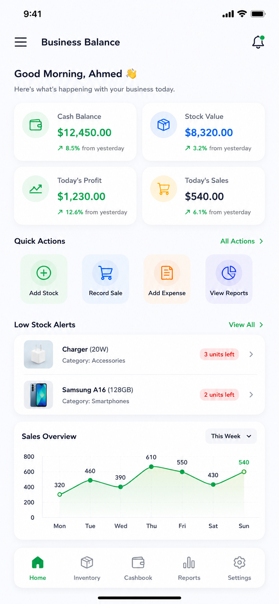
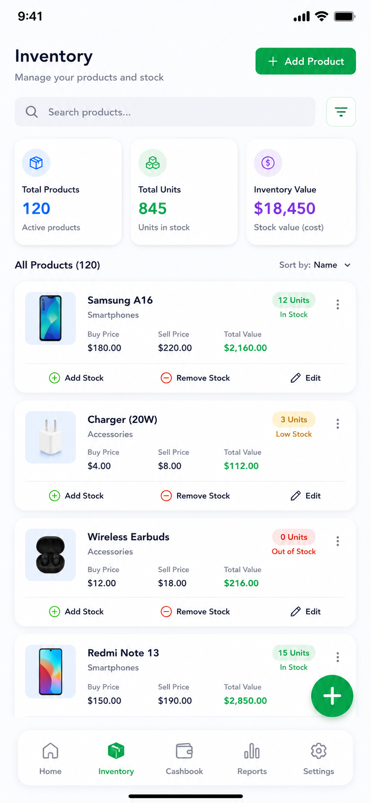
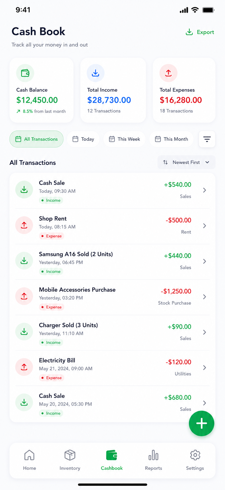

# ⚖️ Business Balance


> **Simple but useful.** Not a POS. Not accounting software. Not a warehouse system.
> A **business balancing app**.

The **Business Balance** application is a mobile tool designed for small and medium-sized
retail businesses to help owners monitor both their inventory and finances in
one place. It enables users to track products, record stock coming in and going
out, monitor cash inflows and expenses, and view the current value of their
inventory. By providing summaries of sales, expenses, profits, losses, and cash
balances, the application gives business owners a clear picture of their
financial position. Its simple and intuitive design helps users make informed
decisions about restocking, controlling expenses, and improving profitability
without the complexity of a full accounting or enterprise management system.

---

## 🔹 The Key Idea

Instead of simply stating stock quantities, the app provides actionable financial
insights for the owner:

- The total cost value of the current inventory.
- Expected revenue and profit upon selling the stock.
- The business's overall current cash balance.
- Total business assets (Cash + Stock value).

That way, the owner doesn't just know **what's in stock**—they understand **the
financial position of the business**, which helps them decide whether they can
restock, whether profits are improving, and where money is tied up. This keeps
the application focused, practical, and easy for a small or medium-sized shop
to use.

---

## 🔸 Navigation & Structure

Since it's a mobile application, we keep it to as few screens as possible while
keeping everything easy to access.

### Bottom Navigation

To keep navigation simple, we use five main tabs:

```text
✧ Home | ✧ Inventory | ✧ Cashbook | ✧ Reports | ✧ Settings
```

Floating action buttons or dashboard shortcuts are available for common tasks:

- ⊞ Add Product
- ⊞ Add Stock
- ⊞ Record Sale
- ⊞ Add Expense

---

## 🔹 Modules & Screens

The app is organized into 10 simple screens across the 5 main tabs.

### 1. Login Screen

- Email/Username
- Password
- Login button

### 2. Dashboard (Home)

This is the first screen after login.
Shows:

- ⬩ Cash Balance
- ⬩ Stock Value
- ⬩ Profit/Loss
- ⬩ Low Stock Items
- Quick summary of today's activity

*Quick action buttons:* Add Stock, Record Sale, Add Expense, View Reports.

### 3. Inventory

This is only for tracking quantities. List of all products.
For each product:

- Product Name
- Category
- Buying Price & Selling Price
- Quantity in stock (units)

*Actions:* Search, Add Product, Tap a product to edit.

### 4. Product Details

Shows information about one product.

- Name, Category, Buying Price, Selling Price, Current Units
- *Buttons:* Add Stock, Remove Stock, Edit Product

### 5. Add/Edit Product

Form with:

- Product Name, Category, Buying Price, Selling Price, Initial Quantity

### 6. Cashbook

Track all money entering and leaving the business.
Shows all money movements (Income, Expenses, Current cash balance).
Each record:

- Date, Description, Amount, Income or Expense
- *Button:* Add Transaction

### 7. Add Transaction

Simple form for adding to the cashbook.

- Type (Income/Expense), Amount, Description, Date

### 8. Sales

A simple way to record sales.

- Fields: Product, Quantity Sold
- *The app automatically:* Reduces stock, calculates sale amount, and adds money
  to the cashbook.

### 9. Reports

Simple financial summaries to show the owner the total stock value, total sales,
total expenses, gross profit, net profit, and estimated business value.

- Daily Summary
- Weekly Summary
- Monthly Summary
- Inventory Report
- Profit Report

### 10. Settings

- Business Name, Currency, Low Stock Limit, Logout

---


## 🎨 Design & Color Palette

The app follows a **Modern Fintech + Material 3** design philosophy, relying
on a neutral background with soft accent colors to highlight important
information. This makes the application feel professional, trustworthy,
and easy to scan.

### Typography
- **Primary Font:** Inter or Roboto (Clean, highly legible sans-serif)
- **Headings:** Semi-bold or Bold for hierarchy and clear sectioning
- **Data/Numbers:** Monospaced or tabular numbers for easy reading of financial figures

### Color Palette

| Purpose | Color |
| :--- | :--- |
| Background | `#F8FAFC` |
| Card | `#FFFFFF` |
| Primary Green | `#10B981` |
| Success Light | `#ECFDF5` |
| Blue | `#3B82F6` |
| Blue Light | `#EFF6FF` |
| Orange | `#F59E0B` |
| Orange Light | `#FFF7ED` |
| Purple | `#8B5CF6` |
| Purple Light | `#F5F3FF` |
| Error | `#EF4444` |
| Error Light | `#FEF2F2` |
| Primary Text | `#111827` |
| Secondary Text | `#6B7280` |
| Disabled Text | `#9CA3AF` |
| Divider | `#E5E7EB` |

### Screen Breakdowns

#### 1. Home (Dashboard)
The dashboard provides an immediate overview of the business's financial position at a glance. It utilizes color-coded cards to draw attention to critical metrics (e.g., Cash Balance, Stock Value, and Profit/Loss) and offers quick access to the most frequent actions.


#### 2. Inventory
The Inventory screen keeps track of all products with clear visual hierarchy. Products are displayed in clean list items with their respective quantities, buying/selling prices, and subtle color indicators for stock health.


#### 3. Cashbook
The Cashbook acts as a transparent ledger of all business transactions. Incomes and expenses are distinctively marked with green and red indicators respectively, making it simple to track the flow of money.

